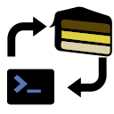

# generator-cake-addin



[![standard-readme compliant][]][standard-readme]
[](#contributors)
[![Travis build][travisimage]][travis]
[![Codecov Report][codecovimage]][codecov]
[![NPM package][npmimage]][npm]
![CodeQL][codeqlbadge]

> A yeoman generator to get you quickly set up for writing Cake Addins

This generator will get you set up with a basic project structure for
a new Cake Addin, as well as adding basic configuration, documentation,
and a cake build script using Cake.Recipe (with bootstrappers).
It will also add a appveyor build file (optionally with linux enabled) and
an optional travis build file.

## Table of Contents

- [Install](#install)
- [Usage](#usage)
- [Maintainer](#maintainer)
- [Contributing](#contributing)
  - [Contributors](#contributors)
- [License](#license)

## Install

Installing through npm

```sh
npm install --global yo generator-cake-addin
```

Installing through yarn

```sh
yarn global add yo generator-cake-addin
```

## Usage

The most basic use of the generator is to run the main generator by using the following command:

```sh
yo cake-addin
```

You may also run any of the sub generators located in [the source directory][subgenerators]
(all folders except `app` and `utils` a sub-generator).

```sh
yo cake-addin:sub-generator
```

## Maintainer

[Kim J. Nordmo @AdmiringWorm][maintainer]

## Contributing

generator-cake-addin follows the [Contributor Covenant][contrib-covenant] Code of Conduct.

We accept Pull Requests.
Please see [the contributing file][contributing] for how to contribute to generator-cake-addin.

Small note: If editing the Readme, please conform to the [standard-readme][] specification.

This project follows the [all-contributors][] specification. Contributions of any kind welcome!

### Contributors

Thanks goes to these wonderful people ([emoji key][emoji-key]):

<!-- ALL-CONTRIBUTORS-LIST:START - Do not remove or modify this section -->
<!-- prettier-ignore -->
<table><tr><td align="center"><a href="https://github.com/AdmiringWorm"><br /><sub><b>Kim J. Nordmo</b></sub></a><br /><a href="#maintenance-AdmiringWorm" title="Maintenance">🚧</a> <a href="https://github.com/WormieCorp/generator-cake-addin/commits?author=AdmiringWorm" title="Code">💻</a> <a href="https://github.com/WormieCorp/generator-cake-addin/commits?author=AdmiringWorm" title="Documentation">📖</a> <a href="#ideas-AdmiringWorm" title="Ideas, Planning, & Feedback">🤔</a> <a href="#review-AdmiringWorm" title="Reviewed Pull Requests">👀</a> <a href="https://github.com/WormieCorp/generator-cake-addin/commits?author=AdmiringWorm" title="Tests">⚠️</a></td><td align="center"><a href="https://github.com/apps/allcontributors"><br /><sub><b>allcontributors[bot]</b></sub></a><br /><a href="https://github.com/WormieCorp/generator-cake-addin/commits?author=allcontributors[bot]" title="Documentation">📖</a></td><td align="center"><a href="http://www.gep13.co.uk/blog"><br /><sub><b>Gary Ewan Park</b></sub></a><br /><a href="#video-gep13" title="Videos">📹</a> <a href="https://github.com/WormieCorp/generator-cake-addin/commits?author=gep13" title="Code">💻</a> <a href="https://github.com/WormieCorp/generator-cake-addin/issues?q=author%3Agep13" title="Bug reports">🐛</a></td></tr></table>

<!-- ALL-CONTRIBUTORS-LIST:END -->

## License

[GNU General Public License v3.0 or later © Kim J. Nordmo][license]

[all-contributors]: https://github.com/all-contributors/all-contributors
[codecov]: https://codecov.io/gh/WormieCorp/generator-cake-addin
[codecovimage]: https://img.shields.io/codecov/c/github/WormieCorp/generator-cake-addin.svg?logo=codecov&style=flat-square
[codeqlbadge]: https://github.com/WormieCorp/generator-cake-addin/workflows/CodeQL/badge.svg
[contrib-covenant]: https://www.contributor-covenant.org/version/1/4/code-of-conduct
[contributing]: CONTRIBUTING.md
[emoji-key]: https://allcontributors.org/docs/en/emoji-key
[maintainer]: https://github.com/AdmiringWorm
[npm]: https://www.npmjs.com/package/generator-cake-addin
[npmimage]: https://img.shields.io/npm/v/generator-cake-addin.svg?logo=npm&style=flat-square
[license]: LICENSE
[subgenerators]: https://github.com/WormieCorp/generator-cake-addin/tree/develop/src
[standard-readme]: https://github.com/RichardLitt/standard-readme
[standard-readme compliant]: https://img.shields.io/badge/readme%20style-standard-brightgreen.svg?style=flat-square
[travis]: https://travis-ci.org/WormieCorp/generator-cake-addin
[travisimage]: https://img.shields.io/travis/WormieCorp/generator-cake-addin.svg?logo=travis&style=flat-square
